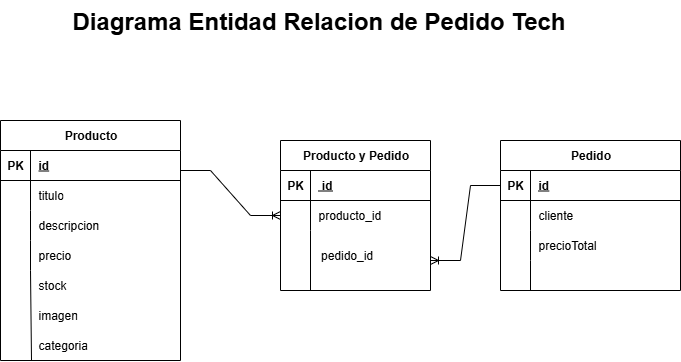

# Pedido Tech
Tienda online de productos tech
- El proyecto productosAPI contiene el servidor de la página. El servidor está implementado con tecnología SpringBoot, framework web del lenguaje JAVA. La persistencia de los datos fué implementada con H2, base de datos en memoria.
- El proyecto frontend contiene código de la interfaz de usuario. Fue implementado con Javascript, HTML5 y CSS.

#### API
La carpeta productosAPI contiene el código para ejecutar el servidor de la página
- abra una terminal en la carpeta productosAPI
- ejecute el comando <code>mvnw package</code>
- luego ejecute el comando <code>mvnw spring-boot:run</code>

Debido a que la persistencia de los datos está implementada con H2 no es necesario ejecutar un motor de base de datos, al ejecutar el servidor ya se incluye la base de datos en la aplicación junto a algunos datos de prueba.
#### Interfaz de usuario
La interfaz de usuario se ejecuta de la siguiente manera
- Ejecute el servidor de la API
- En la carpeta frontend abrir el archivo index.html en el navegador
  - Seleccione los productos que desea comprar y pulse el botón comprar, estos se agregarán al carrito de arriba 
    
    
  &nbsp;
  - Vaya al carrito de compras y pague o cancele la compra

    
    &nbsp;
La interfaz de usuario se comunica con el servidor, donde se ejecuta la API, por medio de endpoints. Estos se obtienen al ejecutarse el servidor y se enumeran a continuación
#### Endpoints
- <code>GET api/product</code>

  Devuelve una lista con los productos registrados

- <code>POST api/product</code>

  Crea un producto

  - body  
        `title`: string (requerido)   
        `price`: double (requerido, no negativo) 
        `stock`: integer (no negativo) 
        `description`: string (requerido)  
        `category`: string  
        `image`: string  

- <code>PUT api/product/{id}</code>

  Actualiza un producto a partir de su id (integer) y el cuerpo de la petición

  - body  
        `title`: string    
        `price`: double  
        `stock`: integer  
        `description`: string  
        `category`: string  
        `image`: string  

- <code>DELETE api/product/{id}</code>

  Elimina un producto a partir de su id (integer)

- <code>GET api/product/{id}</code>

  Obtiene un producto a partir de su id (integer)

#### Diagrama Entidad Relación

La base de datos contiene tablas para las entidades Producto, Pedido y ProductoYPedido. Esta última es una tabla intermedia que relaciona productos a los pedidos realizados. El diagrama es el siguiente

